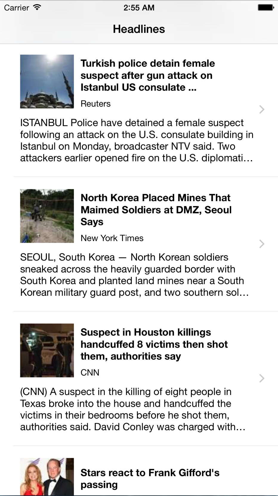

News as Google Curates it via its RSS Feed

Development Environment: Xcode 6.4
Test devices: iPhone 5S and Xcode simulators

<h3>Purpose</h3>
Aggregate and curate the lastest news stories from the Google News RSS feed (http://news.google.com/?output=rss).