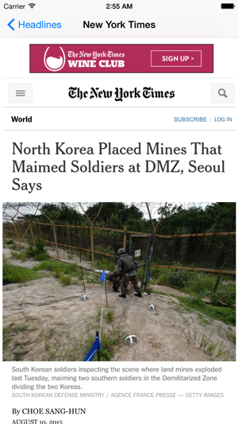

News as Google Curates it via its RSS Feed

Development Environment: Xcode 6.4
 Test devices: iPhone 5S and Xcode simulators

<h3>Purpose</h3>
Aggregate and curate the lastest news stories from the Google News RSS feed (http://news.google.com/?output=rss).

<h3>Dependencies</h3>
Two Cocoa Pods were used in the development of this project: AFNetworking and MBProgressHUD.  Thus, when downloading, the workspace file will need accessed to run the projec after pods have been installed.